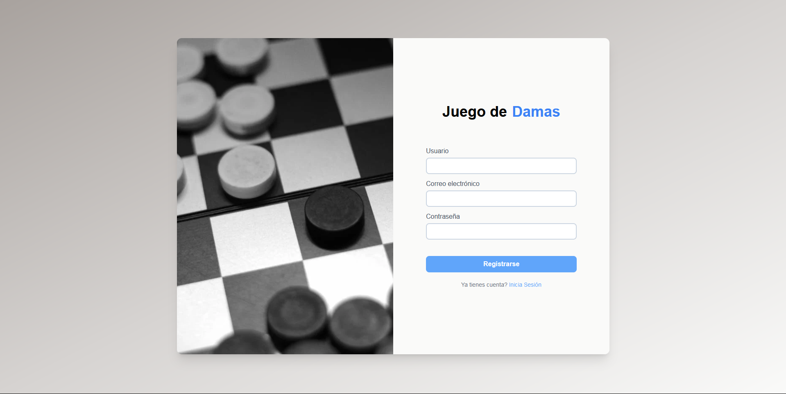
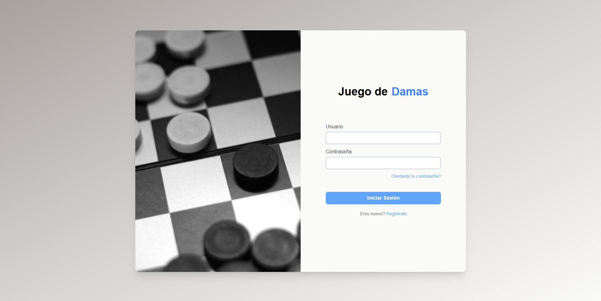
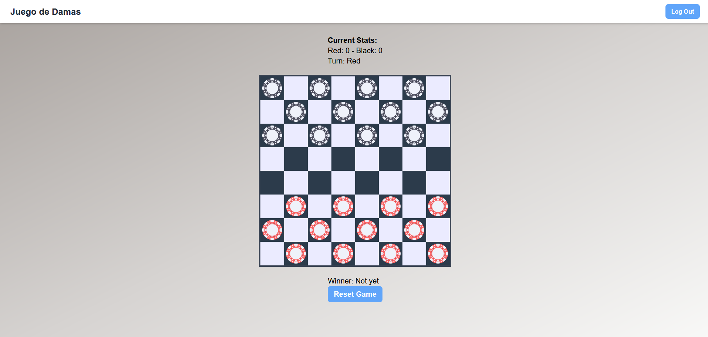
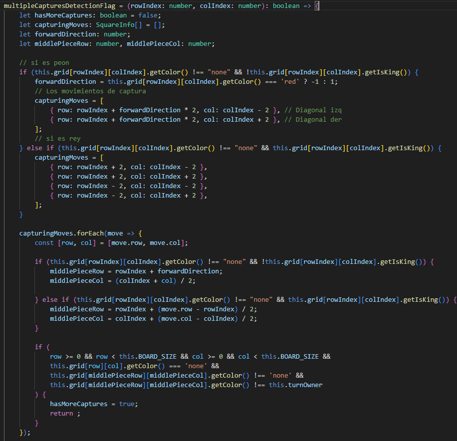
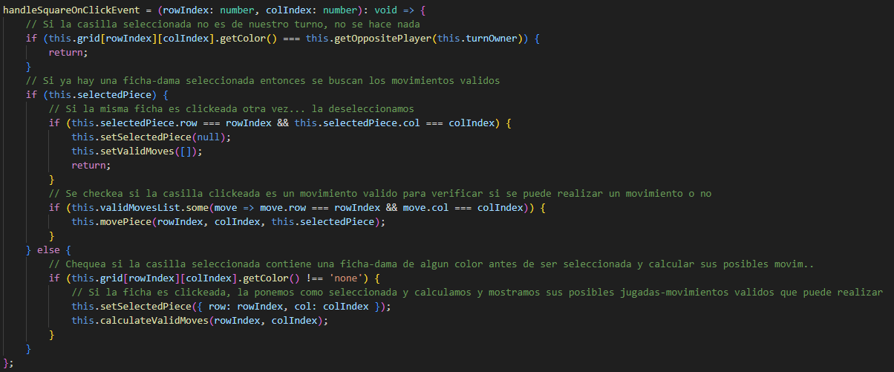
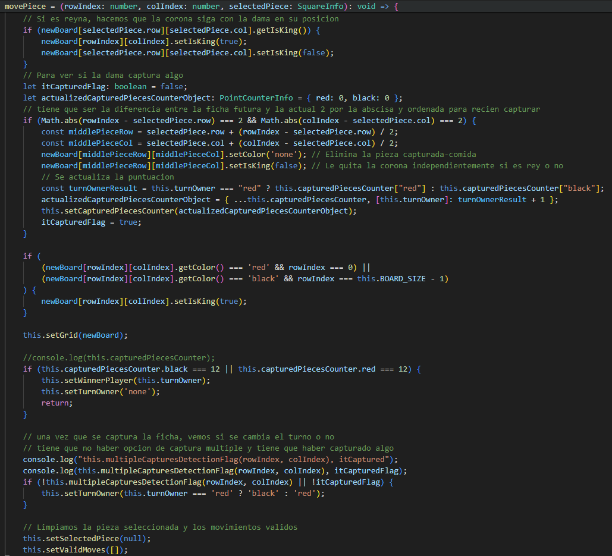
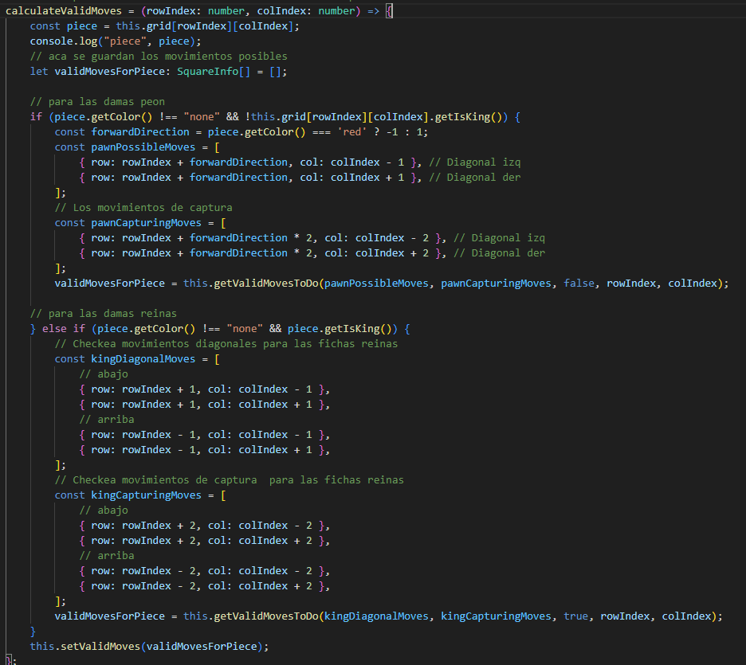

# Reporte del Sprint 3

## I) HISTORIAS DE USUARIOS

| ID  |    Nombre de la historia de usuario     |                                                           Descripción de la historia de usuario                                                           | Prioridad | Esfuerzo Estimado | Esfuerzo real |   Estado   |             Desarrollador              |
| :-: | :-------------------------------------: | :-------------------------------------------------------------------------------------------------------------------------------------------------------: | :-------: | :---------------: | :-----------: | :--------: | :------------------------------------: |
|  1  |             Iniciar sesión              |                                Como usuario, necesito iniciar sesión para poder acceder a la plataforma del juego de damas                                |   alto    |        3.5        |       5       | Completado |               Omar Vite                |
|  2  |      Registro de cuenta de usuario      |                                             Como nuevo usuario, necesito registrarme para crearme una cuenta.                                             |   alto    |         3         |       5       | Completado |               Omar Vite                |
|  3  |            Cierre de sesión             |                                Como usuario, necesito poder cerrar sesión para evitar accesos no autorizados a mi cuenta.                                 |   alto    |         3         |       -       | Completado |               Omar Vite                |
|  4  |      Visualización del tablero 8x8      |                                  Como programador, mostrar un tablero de ajedrez para el inicio de una partida de damas.                                  |   alto    |        10         |   24 horas    | Completado |      Piero Pilco, Edward Canales       |
|  5  |       Elección del modo de juego        |                                          Como usuario, necesito elegir el modo de juego para iniciar la partida                                           |   medio   |        10         |       -       | Pendiente  |              Piero Pilco               |
|  6  |           Asignación de turno           |                                       Como jugador, necesito saber cuando es mi turno para realizar un movimiento.                                        |   medio   |         5         |       -       | Pendiente  |              Piero Pilco               |
|  7  |        Una partida ha terminado         |                                               Como jugador, necesito saber cuando ha terminado una partida                                                |   bajo    |         6         |       -       | Pendiente  | Piero Pilco, Omar Vite, Edward Canales |
|  8  |       Conteo de piezas atrapadas        |                                             Como programador, necesito contabilizar las piezas atrapadas para                                             |   bajo    |         8         |       -       | Pendiente  | Piero Pilco, Omar Vite, Edward Canales |
|  9  |   Ninguna pieza atrapada en un turno    |        Como programador, necesito mostrar en el tablero la misma cantidad de piezas antes y después de un turno donde no se capturó ninguna pieza.        |   bajo    |         6         |       -       | Pendiente  |              Piero Pilco               |
| 10  |    Captura de una pieza en un turno     |                      Como programador, necesito mostrar en el tablero una pieza menos después de un turno donde se capturó una pieza                      |   bajo    |         8         |       -       | Pendiente  |               Omar Vite                |
| 11  | Captura de más de una pieza en un turno |    Como programador, necesito mostrar n piezas menos (n es la cantidad de piezas capturadas y mayor a 1) después de un turno donde se capturó n piezas    |   bajo    |        24         |       -       | Pendiente  | Piero Pilco, Omar Vite, Edward Canales |
| 12  |         Coronación de una pieza         | Como programador, necesito mostrar una pieza coronada cuando en un turno una pieza llega a la fila más lejana respecto a su posición al inicio del juego. |   bajo    |        15         |       -       | Pendiente  | Piero Pilco, Omar Vite, Edward Canales |
| 13  |     Movimiento de una pieza simple      |                                                Como jugador, necesito mover una pieza simple en un turno.                                                 |   bajo    |        12         |       -       | Pendiente  |             Edward Canales             |
| 14  |    Movimiento de una pieza coronada     |                                               Como jugador, necesito mover una pieza coronada en un turno.                                                |   bajo    |        24         |       -       | Pendiente  | Piero Pilco, Omar Vite, Edward Canales |

## II) CRITERIOS DE ACEPTACION (AC)

|     ID y nombre de la lista de usuario      | AC ID |                                                                                                                     Descripcion del criterio de aceptacion                                                                                                                     |   Estado   |             Desarrollador              |
| :-----------------------------------------: | :---: | :----------------------------------------------------------------------------------------------------------------------------------------------------------------------------------------------------------------------------------------------------------------------------: | :--------: | :------------------------------------: |
|              1 Iniciar sesión               |  1.1  |                                                         AC 1.1 <Inicio de sesión exitoso> Dado un usuario cuando ingresa un ID y contraseña correcta. Entonces el sistema le muestra la interfaz de inicio del juego.                                                          | Completado |               Omar Vite                |
|                                             |  1.2  |                                      AC 1.2 <Inicio de sesión fallido> Dado un jugador cuando ingresa un ID o contraseña incorrecta. Entonces el sistema le muestra un mensaje de error y no le muestra la interfaz de inicio del juego.                                       | Completado |               Omar Vite                |
|      2. Registro de cuenta de usuario       |  2.1  |                                                      AC 2.1 <Registro de cuenta de usuario exitoso> Dado un usuario cuando se registra con datos válidos. Entonces el sistema le muestra un mensaje de registro exitoso.                                                       | Completado |               Omar Vite                |
|                                             |  2.2  |                                                     AC 2.1 <Registro de cuenta de usuario fallido> Dado un usuario cuando se registra con datos no válidos. Entonces el sistema le muestra un mensaje de registro fallido.                                                     | Completado |               Omar Vite                |
|             3. Cierre de sesión             |  3.1  |                                                                             AC 3.1 <Sesión cerrada> Dado un usuario cuando da click en el botón de cierre de sesión. Entonces la sesión se cierra.                                                                             | Completado |               Omar Vite                |
|      4. Visualización del tablero 8x8       |  4.1  |                          AC 4.1 <Tablero 8x8 de inicio de partida> Dado un jugador cuando ya seleccionó el modo de juego y le da click a “empezar”. Entonces se muestra un tablero de ajedrez con las fichas colocadas para el inicio de la partida.                           | Completado |      Piero Pilco, Edward Canales       |
|        5. Elección del modo de juego        |  5.1  |                                                                 AC 5.1 <Modo de juego online> Dado un jugador cuando selecciona el modo de juego online. Entonces se crea una partida en modo de juego online.                                                                 | Pendiente  |              Piero Pilco               |
|                                             |  5.2  |                                                AC 5.2 <Modo de juego contra la máquina> Dado un jugador cuando selecciona el modo de juego contra la máquina. Entonces se crea una partida en modo de juego contra la máquina.                                                 | Pendiente  |              Piero Pilco               |
|                                             |  5.3  |                                                         AC 5.3 <Modo de juego cara a cara> Dado un jugador cuando selecciona el modo de juego cara a cara. Entonces se crea una partida en modo de juego cara a cara.                                                          | Pendiente  |              Piero Pilco               |
|           6. Asignación de turno            |  6.1  |                                                            AC 6.1 <Turno asignado exitoso> Dado un jugador X cuando el jugador Y termina su turno. Entonces el sistema debe habilitar el movimiento del jugador X.                                                             | Pendiente  |              Piero Pilco               |
|                                             |  6.2  |                                                       AC 6.2 <Turno asignado fallido> Dado un jugador X cuando el jugador Y aún no termina su turno. Entonces el sistema no debe habilitar el movimiento del jugador X.                                                        | Pendiente  |              Piero Pilco               |
|         7. Una partida ha terminado         |  7.1  |                             AC 7.1 <Una partida terminó con un ganador> Dado un jugador X cuando es el turno del jugador Y y no le queda ninguna pieza por mover o se queda sin piezas. Entonces el juego termina y el jugador X gana la partida.                              | Pendiente  | Piero Pilco, Omar Vite, Edward Canales |
|                                             |  7.2  |                                                                AC 7.2 <Una partida terminó con un empate> Dado un turno cuando a ambos jugadores les queda solo una pieza. Entonces el juego termina en empate.                                                                | Pendiente  | Piero Pilco, Omar Vite, Edward Canales |
|                                             |  7.3  |                                            AC 7.3 <Una partida terminó por rendirse> Dado un jugador X cuando es el turno del jugador Y y da click en el botón rendirse. Entonces el juego termina y el jugador X gana la partida.                                             | Pendiente  | Piero Pilco, Omar Vite, Edward Canales |
|        8. Conteo de pieza atrapadas         |  8.1  |                                                                   AC 8.1 <Cantidad de piezas atrapadas> Dado un jugador X cuando termina su turno. Entonces debe visualizar la cantidad de piezas que atrapó                                                                   | Pendiente  | Piero Pilco, Omar Vite, Edward Canales |
|    9. Ninguna pieza atrapada en un turno    |  9.1  |                  AC 9.1 <Cero piezas atrapadas> Dado un jugador X cuando termina su turno y no atrapó ninguna pieza durante dicho turno. Entonces el sistema debe mostrar la misma cantidad de piezas en el tablero antes y después del turno del jugador X.                   | Pendiente  |              Piero Pilco               |
|    10. Captura de una pieza en un turno     | 10.1  |                                      AC 10.1 <Una pieza atrapada> Dado un jugador X cuando termina su turno y ha atrapado una pieza durante dicho turno. Entonces el sistema debe mostrar una pieza menos después del turno del jugador X                                      | Pendiente  |               Omar Vite                |
| 11. Captura de más de una pieza en un turno | 11.1  |                          AC 11.1 <Más de una pieza atrapada> Dado un jugador X cuando termina su turno y ha atrapado n piezas (n es mayor que 1) durante dicho turno. Entonces el sistema debe mostrar n piezas menos después del turno del jugador X                          | Pendiente  | Piero Pilco, Omar Vite, Edward Canales |
|         12. Coronación de una pieza         | 12.1  |                                    AC 12.1 <Pieza coronada> Dado un jugador X cuando en su turno llega colocar una de sus piezas en la fila más lejana respecto de su posición inicial. Entonces el sistema de que dicha pieza fue coronada                                    | Pendiente  | Piero Pilco, Omar Vite, Edward Canales |
|     13. Movimiento de una pieza simple      | 13.1  |     AC 13.1 <Movimiento de pieza simple> Dado un jugador X cuando en su turno mueve una pieza simple. Entonces el sistema solo le debe permitir mover la pieza, dentro del tablero, hacia adelante en diagonal y respetando las reglas de movimiento de una pieza simple.      | Pendiente  |             Edward Canales             |
|    14. Movimiento de una pieza coronada     | 14.1  | AC 14.1 <Movimiento de pieza coronada> Dado un jugador X cuando en su turno mueve una pieza coronada. Entonces el sistema le debe permitir mover la pieza, dentro del tablero, hacia adelante o atrás en diagonal y respetando las reglas de movimiento de una pieza coronada. | Pendiente  | Piero Pilco, Omar Vite, Edward Canales |

## III) TAREAS DE IMPLEMENTACIÓN

Resumen del codigo de produccion.
| ID y nombre de la historia de usuario | AC ID | Nombre(s) de clase | Nombre(s) del metodo | Desarrollador | Estado | Notas |
| :-: | :-: | :-: | :-: | :-: | :-: | :-: |
| 1 - Iniciar Sesion | 1.1 | Session | setUsername() setPassword() signIn() | Omar Vite | Completado | El login se hace solo con nombre de usuario y contrasena |
| | 1.2 | Session | getErrorMessage() | Omar Vite | Completado | El mensaje de error por el momento se muestra usando una alerta de js |
| 2 - Registro de cuenta de usuario | 2.1 | Session | setUsername() setPassword() setEmail() signUp() | Omar Vite | Completado | Para el registro es necesario un correo electronico |
| | 2.2 | Session | getErrorMessage() | Omar Vite | Completado | El error sucede cuando ya existe una cuenta con ese usuario o correo |
| 3 - Cierre de Sesion | 3.1 | Session | signOut() getErrorMessage() | Omar Vite | Completado | En caso falle el cierre de sesion muestra una alerta |
| 4 - Visualizacion del Tablero 8x8 | 4.1 | Board | getGrid() setGrid() | Piero Pilco | Completado | Se muestra un tablero 8x8 con fichas de color negras y rojas |
|                  13 - Movimiento de una pieza                 |   6.1    |     Board       |                           handleSquareOnClickEvent() getSelectedPiece() getValidMovesList()                            |      Piero Pilco         |    Completado      |                                             Para ver los posibles movimientos de la dama.                          |
|    |   6.2    |       Board         |                           handleSquareOnClickEvent() movePiece()                            |      Piero Pilco         |    Completado      |                                             Para ejecutar el movimiento de la dama y hacer que avance.                         |
|    |   6.2    |       Piece         |                           getColor()                            |      Piero Pilco         |    Completado      |       Para verificar si la dama avanzo de casilla mediante los colores de la clase Piece.         |
|                  12 - Coronación de una pieza            |   7.1    |        Board            |                           handleSquareOnClickEvent() movePiece()                           |      Piero Pilco         |    Completado      |                                             Para hacer el movimiento a la fila limite para que se convierta en reina.                          |
|                         |   7.2    |        Piece            |                           getIsKing() getColor()                           |      Piero Pilco         |    Completado      |                                             Para verificar si la dama luego de moverse a la fila limite se convirtio en reina.                          |
|                  10 - Movimientos de captura           |   10.1   |     Board               |                           handleSquareOnClickEvent() movePiece() getSelectedPiece() getValidMovesList()                 |      Piero Pilco         |    Completado      |                                             Para ejecutar el movimiento de captura a la dama opuesta para una dama peon.                         |
|          |  10.2   |     Piece       |                           getColor()                 |      Piero Pilco         |    Completado      |                                             Para ver si la dama capturada desaparecio y la dama cazadora hizo su avance.                         |
|    |   10.3   |     Board               |                           handleSquareOnClickEvent() movePiece() getSelectedPiece() getValidMovesList()                 |      Piero Pilco         |    Completado      |                                             Para ejecutar el movimiento de captura a la dama opuesta para una dama reina.                         |
|          |  10.4 |     Piece       |                           getColor() getIsKing()                 |      Piero Pilco         |    Completado      |                                             Para ver si la dama capturada desaparecio y la dama cazadora hizo su avance y tambien si sigue con su corona.                         |
|                  11 - Captura de más de una pieza en un turno            |   9.1   |     Board               |                           handleSquareOnClickEvent() movePiece() getSelectedPiece() getValidMovesList()                 |      Piero Pilco         |    Completado      |                                             Para hacer los movimientos de capturas multiples para una dama peon.                         |
|          |  11.1   |     Piece       |                           getColor()                 |      Piero Pilco         |    Completado      |                                             Para ver si las dama capturadas desaparecieron y la dama cazadora hizo su avance.                         |
|    |   11.2   |     Board               |                           handleSquareOnClickEvent() movePiece() getSelectedPiece() getValidMovesList()                 |      Piero Pilco         |    Completado      |                                             Para hacer los movimientos de capturas multiples para una dama reina.
|          |  11.3  |     Piece       |                           getColor() getIsKing()                 |      Piero Pilco         |    Completado      |                                             Para ver si las dama capturadas desaparecieron y la dama cazadora hizo su avance y si sigue siendo reina.                          |

Resumen del código de prueba automatizado (que corresponde directamente a algunos criterios de aceptación)
| ID y nombre de la lista de usuario | AC ID | Nombre(s) de clase del código de prueba | Nombre(s) del método del código de prueba | Descripción del caso de prueba (entrada y salida esperada) | Estado | Desarrollador |
| :-: | :-: | :-: | :-: | :-: | :-: | :-: |
| 1 - Iniciar Sesion | 1.1 | Session | setUsername() setPassword() signIn() | Entrada: Usuario y Contrasena validas --- Salida: Se ha iniciado sesion correctamente | Completado | Omar Vite|
| | 1.2 | Session | getErrorMessage() | Entrada: Usuario y contrasena no validos --- Salida: No se ha podido iniciar sesion | Completado | Omar Vite |
| 2 - Registro de cuenta de usuario | 2.1 | Session | setUsername() setEmail() setPassword() signUp()| Entrada: Usuario , Correo y Contrasena validas --- Salida: Se ha registrado correctamente | Completado | Omar Vite |
| | 2.2 | Session | getErroMessage() | Entrada: Usuario y/o Email no validos --- Salida: No se ha podido registrar | Completado | Omar Vite|
| 3 - Cierre de Sesion | 3.1 | Session | signOut() | Entrada: Simulacion de cierre de sesion --- Salida: Cierre de sesion exitoso | Completado |Omar Vite |

## IV) DISEÑO DEL CODIGO DE PRODUCCION FINAL

### Interfaz de Usuario

- Formulario de Registro

- Formulario de Inicio de Sesion

- Tablero de Juego

### Arquitectura de Software

### Algoritmos

- Algoritmo para los movimientos de captura de pieza

- Algoritmo para seleccionar una pieza en un slot especifico

- Algoritmo para mover una pieza simple

- Algoritmo para calcular los movimientos validos ya sea de una pieza simple o de una reyna

### Extensibilidad

- Jugabilidad online con usuarios de cualquier parte del mundo
- Implementacion de historial de partidas
- Mejorar la experiencia de juego con animaciones visuales de victoria o derrota
- Implementacion de modos de juego

## V) HALLAZGOS DEL EJERCICIO DE REVISION FINAL

## VI)  ACTAS DE TODAS LAS REUNIONES

|   Fecha    | Tiempo y duracion |     Lugar     |    Participante     |                                                                     Proposito de la reunion                                                                      | Elementos de accion especificos                                                                      |
| :--------: | :---------------: | :-----------: | :-----------------: | :--------------------------------------------------------------------------------------------------------------------------------------------------------------: | ---------------------------------------------------------------------------------------------------- |
| 01/04/2024 |        2h         |  Google Meet  | Piero, Edward, Omar | Establecer los requerimientos del proyecto así como evaluar el valor de esfuerzo que le tomaría a cada miembro hacer tareas particulares mediante el juego poker | -Plantear historias de usuario -Plantear criterios de aceptación -Definir roles y tareas principales |
| 03/04/2024 |        3h         | Biblioteca FC | Piero, Edward, Omar |                      Definir tecnologías a usar y también establecer el uso de la plataforma ClickUp para acercanos a la metodología SCRUM                       | -Crear entorno de desarrollo front (ts + js) -Conexión al back (python + MySql + WebSockets)         |
| 05/04/2024 |        1h         | Biblioteca FC | Piero, Edward, Omar |       Coordinar fechas de las siguientes reuniones, conversar sobre los avances del proyecto y redefinir las historias de usario y criterios de aceptación       | - Coordinar fechas de reuniones - Reunión de retroalimentación - backlog grooming                    |

## VII)  CALIFICACIONES DE AMIGOS

|                                | Edward Alexander Canales Yarin | Piero Fernando Pilco Reynoso | Omar Baldomero Vite Allca |
| :----------------------------: | :----------------------------: | :--------------------------: | :-----------------------: |
| Edward Alexander Canales Yarin |               19               |              19              |            19             |
|  Piero Fernando Pilco Reynoso  |               19               |              19              |            19             |
|   Omar Baldomero Vite Allca    |               19               |              19              |            19             |
|            Promedio            |               19               |              19              |            19             |

## IX)  LECCIONES APRENDIDAS

|             Integrantes                   | Lecciones Aprendidas | 
| :----------------------------: | :----------------------------: | 
| Edward Alexander Canales Yarin |                            |              
|  Piero Fernando Pilco Reynoso  |                            |              
|   Omar Baldomero Vite Allca    |      Implementacion de sessiones con python y flask  - Uso de MySQL workbench - Testing con Jasmine - Uso de Clickup para el trabajo en equipo        |              
